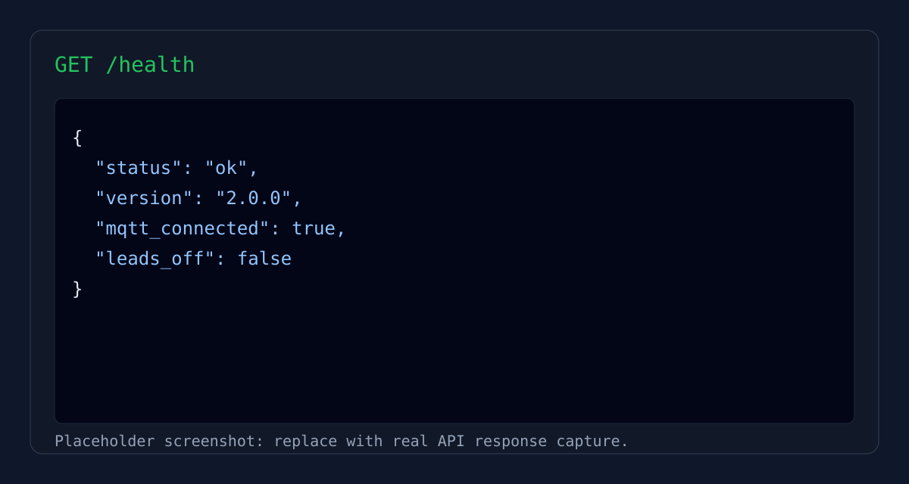
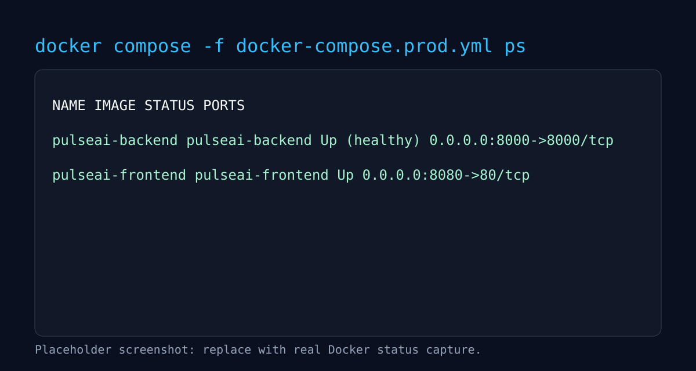
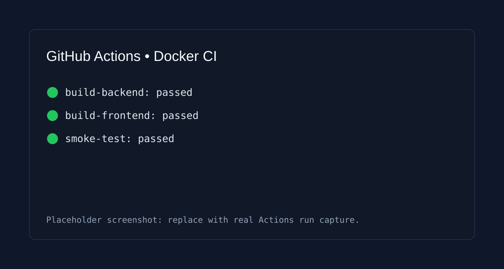

# PulseAI Production Deployment

Production-ready Docker deployment for PulseAI backend and frontend, pinned to Python 3.10.11.

## Production Verification Report
Validated in this workspace:
- Docker version: 29.2.1
- Docker Compose version: v5.1.0
- Backend health: status=ok on http://127.0.0.1:8000/health
- Frontend health: HTTP 200 on http://127.0.0.1:8080

Verified containers:
- pulseai-backend: healthy
- pulseai-frontend: running

## What Was Added
- Dockerized backend with Python 3.10.11 base image.
- Dockerized frontend with Vite build + Nginx runtime.
- Production Docker Compose file.
- GitHub Actions workflow for Docker build + smoke test.
- Windows one-command production startup script.
- Screenshot placeholders for deployment documentation.

## Project Structure
- backend/Dockerfile
- frontend/Dockerfile
- frontend/nginx.conf
- docker-compose.prod.yml
- .github/workflows/docker-ci.yml
- scripts/start-prod.ps1
- .env.example
- docs/screenshots/backend-health.svg
- docs/screenshots/docker-containers.svg
- docs/screenshots/github-actions.svg

## Prerequisites
- Docker Desktop installed and running.
- Port 8000 and 8080 available.

## 1. Configure Environment
Copy env template and set values:

```powershell
Copy-Item .env.example .env
```

Optional:
- Set COLAB_INFERENCE_URL to route inference to Colab endpoint.
- Keep it empty to use local backend inference path.

## 2. Build and Run (Production)

```powershell
docker compose -f docker-compose.prod.yml up --build -d
```

Windows one-command option:

```powershell
./scripts/start-prod.ps1
```

Verify:

```powershell
docker compose -f docker-compose.prod.yml ps
curl http://localhost:8000/health
```

App URLs:
- Frontend: http://localhost:8080
- Backend API: http://localhost:8000

## 3. Stop Stack

```powershell
docker compose -f docker-compose.prod.yml down
```

## 4. GitHub Actions (Docker CI)
Workflow file:
- .github/workflows/docker-ci.yml

Pipeline validates:
- Backend Docker build
- Frontend Docker build
- Backend health endpoint smoke test

## Screenshots
Deployment screenshots currently use placeholders in SVG format:





Replace these with real screenshots from your machine and GitHub Actions run:
- docs/screenshots/backend-health.png
- docs/screenshots/docker-containers.png
- docs/screenshots/github-actions.png

Then update README image links if needed.

## Push to GitHub

```powershell
git add .
git commit -m "Add production Docker deployment with Python 3.10.11 and CI"
git push origin main
```

## Notes
- Backend currently supports local mode and Colab bridge mode via COLAB_INFERENCE_URL.

## SDG Impact Coverage

PulseAI now includes an SDG alignment workflow to track impact claims with evidence artifacts.

Primary mapped goals:
- SDG-3 (Good Health and Well-Being)
- SDG-9 (Industry, Innovation and Infrastructure)
- SDG-10 (Reduced Inequalities)
- SDG-12 (Responsible Consumption and Production)
- SDG-16 (Peace, Justice and Strong Institutions)
- SDG-17 (Partnerships for the Goals)

Generate SDG impact reports:

```powershell
python scripts/sdg_impact_report.py
```

Generated outputs:
- test_results/sdg_impact_report.json
- docs/sdg_impact_report.md
- docs/sdg_coverage_framework.md

## Troubleshooting

If Docker works in Docker Desktop but not in terminal:

1. Add this path to your system PATH:

```text
C:\Program Files\Docker\Docker\resources\bin
```

2. Restart VS Code and open a fresh terminal.

3. Verify:

```powershell
docker --version
docker compose version
```

If compose says `.env` file is missing:

```powershell
Copy-Item .env.example .env
```
