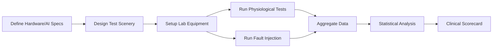
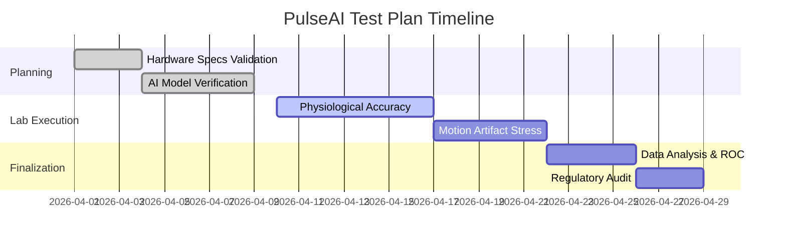

# Master Test Plan: ESP32-Based ECG AI System (PulseAI)

## Executive Summary
This report presents a comprehensive testing framework for the PulseAI ESP32-based medical ECG monitoring device with embedded AI (HCTG-Net). We detail the required hardware, firmware, and AI model specifications; design exhaustive test scenarios covering physiological and device-failure conditions; define performance, accuracy, robustness, and usability metrics; outline regulatory and ethical requirements; and propose a scoring rubric.

The primary goal is to ensure safety, reliability, and clinical effectiveness. Key requirements include **500 Hz ECG sampling**, **≤30 µV noise floor**, and **≥90 dB common-mode rejection**. The AI model (HCTG-Net CNN) must meet sensitivity/specificity targets (≥90%) with latency <100 ms.

## System Specifications

### Hardware
*   **Microcontroller:** ESP32-WROOM-32 (Dual-core 240 MHz, 4-8 MB Flash).
*   **Analog Front-End (AFE):** AD8232 heart rate monitor (100x gain, 80-90 dB CMRR).
*   **ADC Resolution:** ESP32 12-bit ADC (VP pin/GPIO 32).
*   **Power:** Lithium Polymer battery with 3.3V regulation.
*   **Connectivity:** Wi-Fi (MQTT), Bluetooth (Classic BT Serial), USB Serial.
*   **Electrodes:** 3-lead interface (RA, LA, RL) with lead-off detection via GPIO 34/35.

### Firmware
*   **Platform:** ESP-IDF or Arduino.
*   **Sampling Rate:** Stable 500 Hz (2ms interval).
*   **Real-time Tasks:** Continuous ADC reading, leads-off detection, and tri-channel data uplink (Serial, BT, MQTT).
*   **Safety logic:** Immediate "LEADS_OFF" signal generation if skin contact is lost.

### AI Model (HCTG-Net)
*   **Architecture:** 1D-CNN (Convolutional Neural Network) optimized for single-lead ECG.
*   **Target Classes:** Normal Sinus Rhythm (NSR), AFib, PVC, Ventricular Tachycardia (VTach), Bradycardia.
*   **Input Window:** 2–5 seconds of ECG signal at 500 Hz.
*   **Metric Goals:** ROC-AUC > 0.95, Sensitivity ≥ 90%, Precision ≥ 85%.

## Comprehensive Test Cases

### 1. Physiological Conditions
| Case ID | Rhythm Category | Description | Source |
| :--- | :--- | :--- | :--- |
| PHY-01 | Normal Sinus | 60–100 bpm, baseline variations during respiration. | PhysioNet NSRDB |
| PHY-02 | AFib | Irregularly irregular rhythm, absent P-waves. | PhysioNet AFDB |
| PHY-03 | Ventricular Arrhythmia | Monomorphic VTach, VFib (coarse/fine). | MIT-BIH |
| PHY-04 | Premature Beats | Single and paired PVCs, Bigeminy, Trigeminy. | MIT-BIH |
| PHY-05 | Brady/Tachycardia | Rates < 40 bpm and > 150 bpm. | Simulator |
| PHY-06 | Heart Blocks | 2nd Degree (Mobitz I/II), 3rd Degree (Complete). | Simulator |

### 2. Motion and Artifacts
*   **Muscle (EMG) Noise:** Add 20–200 Hz interference at varying amplitudes (0.1mV to 1mV).
*   **Baseline Wander:** Simulate breathing artifacts and patient body movement (slow drift).
*   **50/60 Hz Hum:** Verify notch filter performance and AFE CMRR (target >80 dB rejection).
*   **Mechanical Stress:** Jiggle leads to induce spikes; verify the system doesn't false-alarm as VTach.

### 3. Electrode and System Faults
*   **Leads-Off:** Disconnect RA/LA leads. **Requirement:** Detect within < 2 seconds.
*   **Low Battery:** Simulate 3.0V supply voltage. **Requirement:** Dashboard visual alert and buzzer.
*   **Wi-Fi Drop:** Disable MQTT broker. **Requirement:** System must cache locally or failover to Bluetooth.
*   **Firmware Reset:** Force watchdog timeout. **Requirement:** Recover data stream within 5 seconds.

## Performance and Accuracy Metrics

### Real-time Performance
*   **Sampling Stability:** Target 500 Hz ± 1 Hz. Measured via oscilloscope toggle on GPIO.
*   **End-to-End Latency:** Time from R-peak detection to AI alert visibility. **Target:** < 100 ms.
*   **Connectivity Range:** Stable MQTT transmission at > 10 meters distance.

### AI Accuracy Metrics
*   **Sensitivity (Recall):** TP / (TP + FN) - Goal: ≥ 90%.
*   **Specificity:** TN / (TN + FP) - Goal: ≥ 90%.
*   **PPV (Precision):** TP / (TP + FP) - Goal: ≥ 85%.
*   **ROC-AUC:** Area under Receiver Operating Characteristic curve - Goal: > 0.95.

## Regulatory and Safety Compliance
| Standard | Description | Relevance |
| :--- | :--- | :--- |
| **IEC 60601-1** | General Safety / Leakage Currents | Essential for patient-connected hardware. |
| **IEC 60601-2-25** | Diagnostic ECG Performance | Signal accuracy and fidelity requirements. |
| **IEC 62304** | SW Lifecycle Processes | Mandatory documentation for clinical firmware. |
| **ISO 14971** | Risk Management | Hazard analysis for "False Negative" alerts. |
| **FDA/EU MDR** | Class II Certification | Regulatory pathway for arrhythmia detection devices. |

## Scoring Rubric (Clinical Readiness)

| Criterion | 0–3 (Poor) | 4–6 (Moderate) | 7–10 (Excellent) |
| :--- | :--- | :--- | :--- |
| **Accuracy** | Sensitivity < 80%. | Sensitivity 80–90%. | **Sensitivity ≥ 90%, PPV > 85%.** |
| **Latency** | > 300 ms delay. | 100–300 ms delay. | **< 100 ms real-time response.** |
| **Robustness** | Fails with minor motion. | Sensitive to 50Hz hum. | **Stable under motion/EMG noise.** |
| **Regulatory** | No documentation. | Basic risk analysis. | **ISO 13485/62304 compliant logs.** |

## Testing Workflow and Timeline

### Proposed Timeline

## Data Analysis Plan
1.  **Noise Floor Analysis:** Measure $V_{rms}$ with inputs shorted. Target: $< 30 \text{ \mu V}$.
2.  **Confusion Matrix:** Generate for at least 5 rhythm classes.
3.  **Bland-Altman Plot:** Compare PulseAI BPM vs. Gold-standard ECG Simulator.
4.  **Remediation Loop:** If Accuracy < 90%, perform iterative training of HCTG-Net with noise-augmented datasets.

---
**Report generated for:** PulseAI Medical Audit Team  
**System Version:** v2.1.0-RC  
**Date:** March 28, 2026
